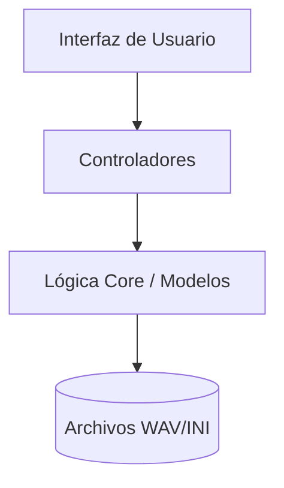

# Bienvenido a VocalParam

VocalParam es un sistema de código abierto diseñado para unificar el proceso de grabación y configuración de voicebanks para síntesis vocal (UTAU/OpenUtau).

## Filosofía del Proyecto: El "Zero-Switch"

Desde su concepción, VocalParam ha sido diseñado bajo la premisa de eliminar el cambio constante de aplicaciones durante la creación de un voicebank. Tradicionalmente, un creador debe grabar en OREMO y luego parametrizar en SetParam o vLabeler. 

Nuestra filosofía **Zero-Switch** unifica estas fases:
- **Calidad en el Origen**: Al parametrizar mientras grabas, puedes detectar errores fonéticos o de ritmo al instante.
- **Flujo Sofisticado**: Una interfaz premium que respeta la precisión técnica exigida por los motores de síntesis vocal modernos.

## Características Principales

- **Grabación 7-Moras**: Metrónomo visual y auditivo de alta precisión con sincronización instantánea desde la primera sílaba.
- **Auto-Oto Híbrido**: Generación automática de parámetros basándose en BPM y análisis DSP avanzado.
- **Gestión de Recursos**: Control total sobre las rutas de destino y escucha integrada para control de calidad.
- **Editor Visual**: Ajuste fino de parámetros con feedback inmediato en el espectrograma.

## Estructura del Proyecto

El proyecto sigue una arquitectura **MVC** (Modelo-Vista-Controlador) para asegurar que sea fácil de mantener y escalar.

Consulte la [Guía de Usuario](user_guide.md) para empezar.
