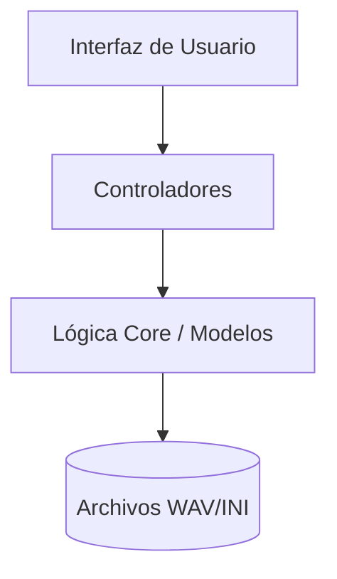

# Bienvenido a VocalParam

VocalParam es un sistema de código abierto diseñado para unificar el proceso de grabación y configuración de voicebanks para síntesis vocal (UTAU/OpenUtau).

## Características Principales

- **Grabación 7-Moras**: Metrónomo visual y auditivo integrado.
- **Auto-Oto**: Generación automática de parámetros basándose en BPM y análisis DSP.
- **Editor Visual**: Ajuste fino de parámetros con feedback inmediato.

## Estructura del Proyecto

El proyecto sigue una arquitectura **MVC** (Modelo-Vista-Controlador) para asegurar que sea fácil de mantener y escalar.

Consulte la [Guía de Usuario](user_guide.md) para empezar.
