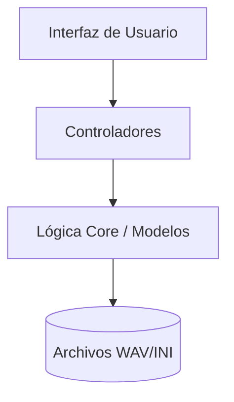

# Bienvenido a VocalParam

VocalParam es un sistema de código abierto diseñado para unificar el proceso de grabación y configuración de voicebanks para síntesis vocal (UTAU/OpenUtau).

## Status Quo: Sprint 3 Finalizado (Visual Editor & DSP)

Actualmente el proyecto ha completado su núcleo visual y de análisis. Contamos con un editor interactivo con espectrograma, sincronización bidireccional y un generador OTO automático inteligente, además de un motor de grabación profesional refinado.

## Filosofía del Proyecto: El "Zero-Switch"

Desde su concepción, VocalParam ha sido diseñado bajo la premisa de eliminar el cambio constante de aplicaciones durante la creación de un voicebank. Tradicionalmente, un creador debe grabar en OREMO y luego parametrizar en SetParam o vLabeler. 

Nuestra filosofía **Zero-Switch** unifica estas fases:
- **Calidad en el Origen**: Al visualizar y escuchar mientras grabas, detectas errores fonéticos al instante.
- **Flujo Sofisticado**: Una interfaz premium que respeta la precisión técnica exigida por los motores de síntesis vocal modernos.

## Características Principales

- **Grabación 7-Moras Pro**: Metrónomo de baja latencia con Count-in sónico y visual.
- **WaveformCanvas Interactivo**: Editor visual con Espectrograma STFT, RMS y drag-and-drop de marcadores.
- **Auto-Oto Híbrido**: Generación automática de parámetros basándose en BPM y análisis DSP de transientes.
- **Sincronización Bidireccional**: Edición fluida entre la tabla de parámetros y el visor visual.
- **Gestión de Recursos**: Control total sobre carpetas de destino y escucha integrada (Play/Listen).

## Estructura del Proyecto

El proyecto sigue una arquitectura **MVC** (Modelo-Vista-Controlador) para asegurar que sea fácil de mantener y escalar.

Consulte la [Guía de Usuario](user_guide.md) para empezar.
